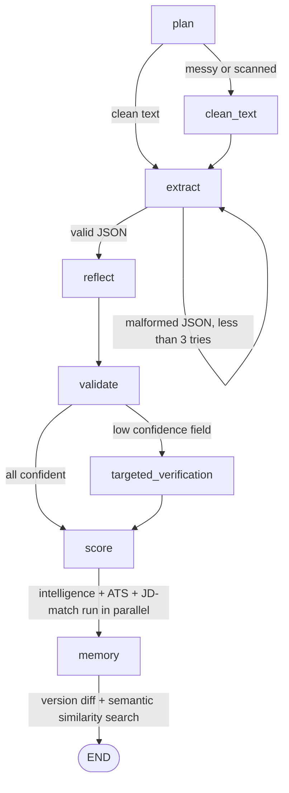

# 🤖 Agentic AI Resume Extractor


> Turns a raw resume into structured, validated, scored JSON — through a
> **stateful multi-agent graph**, not a single prompt.

A resume goes in. A planning agent decides how to handle it. An extraction
agent pulls structured fields using **native OpenAI tool calling**. A
reflection agent double-checks its own work. A validation agent
cross-references companies and universities against a knowledge base. If
anything comes back uncertain, a targeted verification agent — or a human —
steps in. Scoring, ATS matching, and JD comparison all run in parallel.
Every decision is traced, every version is remembered.

## Demo


*(Illustrative sample output — run `python app.py` on your own resume to
generate a real `agent_trace` and `output.json`.)*

---

## Table of Contents
- [Evolution of this project](#evolution-of-this-project)
- [Addressing the code-review feedback](#addressing-the-code-review-feedback)
- [Experimental validation](#experimental-validation)
- [Why this is "agentic," not just an API wrapper](#why-this-is-agentic-not-just-an-api-wrapper)
- [Architecture](#architecture)
- [Example output](#example-output)
- [Features](#features)
- [Project structure](#project-structure)
- [Quickstart](#quickstart)
- [Usage](#usage)
- [Running tests](#running-tests)
- [Docker](#docker)
- [Design decisions](#design-decisions)
- [Known limitations](#known-limitations)
- [Tech stack](#tech-stack)

---

## Evolution of this project

| Version | What it was |
|---|---|
| v1 | A single prompt → single OpenAI call → JSON output |
| v2 | Refactored into a 6-agent pipeline: planning, extraction, reflection, validation, scoring, recommendation — plus tools, schema validation, confidence scores, memory, and a knowledge base |
| v3 | Replaced the fixed pipeline with a real stateful agent graph, switched extraction to genuine OpenAI function/tool calling, added a targeted verification agent, parallelized scoring, and closed the loop with persistent human feedback. Then fully audited: a bug that silently required an API key just to *import* the code (breaking CI) was found and fixed, along with an email-validation bug and a tool-response serialization bug. |
| **v5 (experimental-validation)** | Strengthened the experimental harness with real per-run API telemetry, nested field-level metrics, exact-record match, a fair routing ablation, correction-quality analysis, five-trace extraction, evidence-based failure analysis, and an explicit ground-truth review protocol. No benchmark results are fabricated; real results are produced only after running the evaluation with an API key. |

## Addressing the code-review feedback

The v2 review specifically flagged six gaps between "looks agentic" and
"is agentic." Each one was resolved directly, not just re-described:

| # | Reviewer's gap | Resolution | Evidence |
|---|---|---|---|
| 1 | *"Currently orchestrator [is a] fixed pipeline... dynamic routing/decision making [is] limited"* | Replaced the fixed sequence with a real state machine. Routing decisions are runtime `if` branches over shared state, not a hardcoded call order. | `agent_graph.py` (engine) + `orchestrator.py` (routers: `router_plan`, `router_extract`, `router_validate`, ...) |
| 2 | *"Currently Python functions are manually invoked post-processing"* — not real tool calling | Extraction now uses OpenAI's native `tools=[...]` function-calling API. The **model** decides when to call `validate_email` / `parse_date` / `normalize_skill`, and the code executes exactly what the model requests. | `agents/extraction_agent.py` — see the `TOOLS` schema and the tool-call loop |
| 3 | *"Real dynamic agent routing"* — OCR path, malformed-output path, low-confidence path | Three concrete branches implemented: messy/scanned text → `clean_text` node; malformed JSON → bounded retry loop (max 3); low-confidence field → `targeted_verification` node (new agent, only fires when needed) | `orchestrator.py` routers + `agents/verification_agent.py` |
| 4 | *"Stateful agent graph... LangGraph or custom state-machine"* | Hand-rolled `AgentGraph` + `AgentState` — nodes read/write shared state, routers branch on it, and every run's path is captured in `state.log` | `agent_graph.py` |
| 5 | *"Parallel execution... validation + intelligence calculations parallel"* | `node_score` runs resume-intelligence, ATS scoring, and JD-matching concurrently via `ThreadPoolExecutor` instead of sequentially | `orchestrator.py::node_score` |
| 6 | *"Better memory... semantic memory/vector retrieval"* + *"Human feedback loop... agent memory update"* | Added embedding-based similarity search on top of version history, and human corrections now permanently teach the knowledge base | `semantic_memory.py`, `feedback.py` (`teach_entity` call) |

Run `result["agent_trace"]` after any pipeline call to see the literal path
taken — it's the easiest way to verify #1 and #3 are real, not cosmetic.

## Experimental validation

Architecture alone doesn't prove the agentic approach is better than a
simple prompt - so `eval/` is a self-contained harness that measures it:

- A **non-agentic baseline** (`eval/baseline.py`) using the identical model
  and output schema, for a fair comparison.
- A **50-resume dataset** (`eval/dataset/`), 10 each across 5 categories
  (clean, messy, multi-column, incomplete, ambiguous), reproducibly
  generated with matching ground truth via `generate_dataset.py`.
- **Atomic field-level accuracy, exact-record match, failure rate, latency,
  LLM/embedding calls, tokens, and estimated cost** (`eval/metrics.py` +
  `eval/telemetry.py`), computed identically for every variant.
- An **ablation study** (`orchestrator.AblationConfig`) that independently
  disables reflection, targeted verification, memory, and dynamic routing,
  so any accuracy/cost/latency difference is attributable to that one
  component - not a confound from changing several things at once.
- A **correction-quality report** (`eval/reflection_verification_report.py`)
  that checks whether reflection's and verification's edits actually moved
  the output *closer to* ground truth, not just how many edits they made.
- A full **Agent / Tool / Deterministic Service / Infrastructure**
  classification with justification for every component
  (`eval/component_classification.md`).
- Five actual execution traces with path explanations and evidence-based
  failure-root-cause summaries (`eval/analyze_results.py`).
- A ground-truth review record that explicitly distinguishes reproducible
  synthetic labels from independently human-verified labels
  (`eval/dataset/ground_truth_review.md`).

Run it with `python -m eval.run_evaluation`, then generate the correction and
trace/failure reports with the commands in **[`eval/README.md`](eval/README.md)**.
The repository deliberately does not manufacture benchmark numbers: the final
keep/modify/remove recommendation must be based on the resulting measurements.

## Why this is "agentic," not just an API wrapper

| Capability | Where it lives |
|---|---|
| Plans before acting | `agents/planning_agent.py` assesses the resume (messy? scanned? multi-page?) before extraction starts |
| Calls its own tools | `agents/extraction_agent.py` — the **model itself** decides when to call `validate_email`, `parse_date`, `normalize_skill`, via OpenAI's function-calling API — not post-processing in Python |
| Reflects and self-corrects | `agents/reflection_agent.py` re-reads the source resume and fixes its own extraction |
| Collaborates across specialized agents | Planning → Extraction → Reflection → Validation → (Verification) → Scoring → Recommendation, each with a defined input/output contract |
| Routes dynamically, not linearly | `orchestrator.py` — a messy resume takes a different path than a clean one; a low-confidence field triggers a different path than a confident one; malformed JSON triggers a bounded retry loop |
| Executes in parallel where safe | Resume intelligence, ATS scoring, and JD matching run concurrently via `ThreadPoolExecutor` |
| Remembers across runs | `memory.py` diffs resume versions; `semantic_memory.py` retrieves similar past resumes by *meaning* via embeddings |
| Learns from human correction | `feedback.py` — a human's correction is persisted and immediately teaches the knowledge base, so the same mistake isn't repeated |

## Architecture



Every run returns `agent_trace` — the literal list of nodes visited for
*that specific resume*. Run two different resumes and you'll see two
different traces.

## Example output

```json
{
  "data": {
    "name": "Sriram Singamaneni",
    "email": "sriram@example.com",
    "skills": ["Python", "JavaScript", "Machine Learning"],
    "experience": [
      {
        "company": "Google",
        "title": "Software Engineer",
        "start_date": "2021-06",
        "end_date": "present"
      }
    ],
    "confidence_scores": {"name": 0.98, "email": 0.95, "skills": 0.9},
    "intelligence": {
      "total_experience_years": 3.2,
      "seniority_level": "Mid-level",
      "career_progression_summary": "Software Engineer -> Senior Software Engineer"
    },
    "verified_entities": {"Google": {"verified": true, "matched_to": "Google"}}
  },
  "low_confidence_fields": [],
  "ats_result": {"ats_score": 78.5, "missing_keywords": ["kubernetes", "graphql"]},
  "agent_trace": ["plan", "extract", "reflect", "validate", "score", "memory"]
}
```

## Features

- ✅ Structured extraction with guaranteed JSON Schema (Pydantic)
- ✅ Per-field confidence scores
- ✅ Human-in-the-loop review for low-confidence fields
- ✅ Knowledge-lookup verification of companies/universities (fuzzy matching)
- ✅ Resume ↔ Job Description fit scoring with reasoning
- ✅ ATS score + missing-keyword recommendations
- ✅ Resume intelligence: years of experience, seniority, leadership signals, career progression
- ✅ Version memory — diffs resumes against previous uploads
- ✅ Semantic memory — finds similar past resumes by meaning, not filename
- ✅ Retry + malformed-JSON recovery
- ✅ Structured logging with latency and token-usage metrics
- ✅ PDF and plain-text resume support, with an OCR fallback for scanned/image-based PDFs
- ✅ PII masking in logs + secure file deletion after processing (opt-in)
- ✅ Unit, integration (full graph, faked OpenAI client), and prompt regression tests — all offline, no API key needed
- ✅ Reproducible experimental validation harness: baseline comparison, field-level accuracy, ablation study (`eval/`)
- ✅ Dockerized, with a GitHub Actions CI workflow

## Project structure

```
.
├── app.py                      # entry point
├── orchestrator.py              # builds the agent graph, owns all routing logic
├── agent_graph.py                # state-machine engine (nodes + routers)
├── llm_client.py                  # shared, lazily-initialized OpenAI client
├── schema.py                       # Pydantic models (structured output + confidence)
├── knowledge_base.py                # fuzzy-match entity verification (file-backed)
├── memory.py                         # version history + diffing
├── semantic_memory.py                 # embedding-based similarity search
├── feedback.py                         # human correction loop
├── security.py                          # PII masking, secure delete, filename sanitization
├── agents/
│   ├── planning_agent.py
│   ├── extraction_agent.py              # real OpenAI tool calling
│   ├── reflection_agent.py
│   ├── validation_agent.py
│   ├── verification_agent.py             # targeted re-check for low-confidence fields
│   ├── scoring_agent.py                   # deterministic: intelligence + ATS
│   └── recommendation_agent.py             # resume ↔ JD matching
├── tools/
│   ├── email_validator.py
│   ├── date_parser.py
│   ├── skill_normalizer.py
│   └── pdf_parser.py                        # includes OCR fallback for scanned PDFs
├── utils/
│   ├── logging_config.py                     # PII-redacting logger
│   └── retry.py
├── tests/                                      # unit + integration + prompt regression, all offline
├── eval/                                         # experimental validation harness - see eval/README.md
│   ├── dataset/                                    # resumes + ground truth
│   ├── baseline.py                                  # non-agentic comparison point
│   ├── metrics.py
│   ├── run_evaluation.py                              # ONE command runs the full study
│   ├── reflection_verification_report.py
│   └── component_classification.md
├── docs/demo-run.svg                          # sample output shown above
├── .github/workflows/test.yml                # CI: runs pytest on every push
└── Dockerfile
```

## Quickstart

```bash
git clone https://github.com/sriramsingamaneni95-glitch/agengtic-ai-resume-extractor.git
cd agengtic-ai-resume-extractor
pip install -r requirements.txt
cp .env.example .env        # add your OPENAI_API_KEY
python app.py
```

## Usage

Place a resume at `sample_resume.txt` (or `sample_resume.pdf`) in the
project root, then run `python app.py`. To also get JD matching + ATS
scoring, add a `job_description.txt` file before running.

Output is printed to the console and saved to `output.json`, along with
the `agent_trace` showing exactly which path the graph took. If any field
comes back low-confidence, you'll be prompted in the terminal to confirm
or correct it — corrections are saved and immediately teach the knowledge
base for future runs.

## Running tests

```bash
pytest -v
```

Every test file runs independently and requires **no API key and no
network access**:
- **Unit tests** — routing logic, schema validation, tools, knowledge base
- **Integration tests** (`test_integration.py`) — the full agent graph
  end-to-end (plan → extract → reflect → validate → score → memory),
  including every ablation variant, with the OpenAI client faked out
- **Prompt regression tests** (`test_prompt_regression.py`) — guard
  against a prompt edit silently breaking its contract with the rest of
  the code (e.g. a schema field or tool name quietly disappearing)

`tests/test_no_api_key_required.py` explicitly proves none of this needs
a real key. The **evaluation harness** in `eval/` is separate — it makes
real API calls on purpose, to produce real accuracy/cost numbers (see
[Experimental validation](#experimental-validation) above).

## Docker

```bash
docker build -t resume-extractor .
docker run --env-file .env resume-extractor
```

## Design decisions

- **Deterministic tools over LLM calls where possible.** Dates, email
  validation, skill normalization, ATS keyword overlap, and resume
  intelligence math are all plain Python, not LLM calls — cheaper, faster,
  reproducible, and fully testable without hitting the API.
- **Two OpenAI API styles, used intentionally, not inconsistently.**
  `extraction_agent.py` uses `chat.completions.create(..., tools=[...])`
  because that's the surface that supports native function/tool calling.
  Every other agent only needs "return JSON" and uses the simpler
  `responses.create(..., text={"format":"json_object"})`.
- **Confidence scores drive the human-in-the-loop gate** instead of
  trusting every extraction blindly.
- **Knowledge lookup, not full RAG.** `knowledge_base.py` verifies
  companies/universities with fuzzy string matching against a small
  file-backed list — a lightweight retrieval/knowledge-lookup pattern, not
  a vector-search RAG system. The interfaces (`verify_entity`,
  `teach_entity`, `store_memory`, `retrieve_similar`) are written so a real
  vector DB (Chroma/FAISS/Pinecone) can be swapped in later without
  touching any agent code.

## Known limitations

Stated honestly rather than overclaimed:

- Knowledge base / memory files are flat JSON — fine for a single-user
  demo, not safe for concurrent multi-user writes (no file locking).
- ATS scoring is a deterministic keyword-overlap heuristic, not a
  semantic/ML-based match — fast and explainable, but simpler than a
  production ATS.
- The knowledge base ships with a handful of example companies/
  universities and uses simple fuzzy string matching — it demonstrates a
  retrieval/knowledge-lookup *pattern*, not a production RAG/vector-search
  system or a populated production dataset.
- The human feedback loop runs via terminal `input()` — a web/API
  deployment would replace this with a proper review-queue endpoint.
- PII masking (`security.py`) uses regex for emails/phone numbers — it
  reduces what lands in logs, but isn't a certified PII-detection system.
  Secure delete overwrites-then-removes a file; it's a meaningful
  improvement over a plain `os.remove()`, not full disk-level guarantees.
- OCR (`tools/pdf_parser.py`) requires `pytesseract` + the system
  `tesseract-ocr` binary, which aren't installed by default (see
  `requirements.txt`) — without them, scanned PDFs fall back to whatever
  text layer exists, which may be empty.
- The evaluation harness (`eval/`) ships with a 50-resume dataset and is
  fully built/reproducible, but has not yet been *run* against a real
  OpenAI API key in this environment — no result numbers are fabricated
  or included until `python -m eval.run_evaluation` is actually executed.
  See [`eval/README.md`](eval/README.md) for exactly what that produces.
- No cloud deployment configuration yet (Docker + CI are in place; an
  actual AWS/Render/Railway deploy step is not).

## Tech stack

Python · OpenAI GPT-4.1 (native tool calling) · text-embedding-3-small ·
Pydantic · custom stateful agent graph · pytest (unit + integration +
prompt regression) · Docker · GitHub Actions · OCR (pytesseract, optional)

---

**Author:** Sriram Singamaneni
