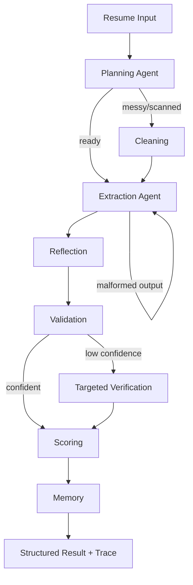
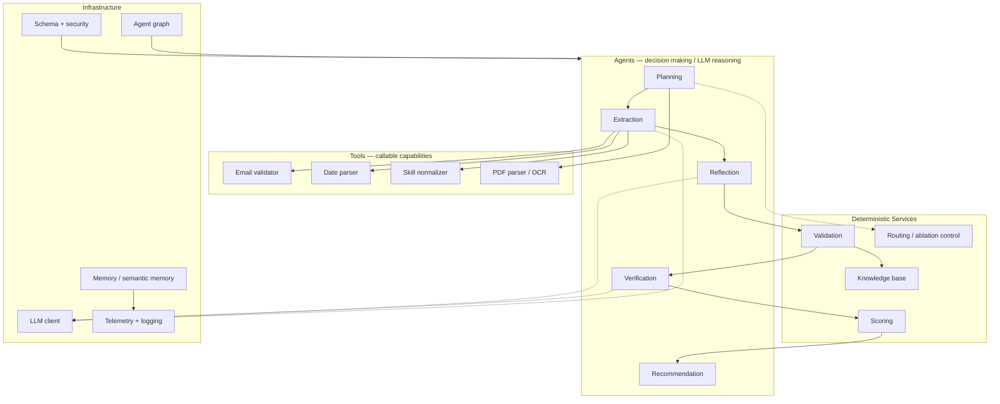

# 🤖 Agentic AI Resume Extractor — Experimental Validation


> **Experimental question:** Does an agentic, stateful resume-extraction system provide measurable benefits over a fair non-agentic baseline, and which components are responsible for those benefits?

This project is not designed to assume that "agentic" is better. It is designed to **measure it**.

The system converts resumes into structured JSON using a stateful multi-agent workflow with planning, extraction, reflection, validation, targeted verification, scoring, memory, and deterministic tools. The `eval/` package provides a reproducible experimental framework to compare that system against a non-agentic baseline and controlled ablations.

---

## 🎯 Experimental Validation

The evaluation is organized around nine requirements.

### 1. Structured telemetry

Every evaluated run is instrumented to capture:

- LLM call count
- input tokens
- output tokens
- embedding calls/tokens where available
- latency
- estimated API cost
- run/variant metadata

Telemetry is recorded per execution rather than inferred from the number of agents in the architecture.

**Implementation:** `eval/telemetry.py`

---

### 2. Representative resume dataset and multi-column stress cases

The evaluation dataset contains **50 representative resumes** across five categories:

| Category | Cases | Purpose |
|---|---:|---|
| Clean | 10 | Standard, well-structured resumes |
| Messy | 10 | Formatting noise and irregular text |
| Multi-column | 10 | Layout/order stress cases |
| Incomplete | 10 | Missing or partially specified fields |
| Ambiguous | 10 | Ambiguous dates, roles, institutions, or wording |

The repository keeps the dataset deterministic and version-controlled.

> **Important experimental distinction:** text-layout stress cases and rendered two-column PDFs are not treated as equivalent evidence. When the final experiment requires **10 actual two-column PDF inputs**, those PDFs must be included in the dataset and referenced explicitly in the evaluation manifest rather than being described as PDFs when they are not.

**Dataset:** `eval/dataset/`

---

### 3. Ground-truth protocol

Generated labels are not automatically treated as independently verified truth.

The evaluation distinguishes:

1. **Generated ground truth** — reproducible labels produced by the dataset generator.
2. **Reviewed ground truth** — labels checked against the source resume by an independent review process.
3. **Verification metadata** — records which samples/fields were reviewed and when.

This prevents the experiment from claiming human verification where none occurred.

**Protocol:** `eval/dataset/ground_truth_review.md`

---

### 4. Strong field-level metrics

Accuracy is evaluated at the field level rather than using only a single high-level score.

The evaluation covers:

- scalar fields such as name, email, and phone
- skills
- experience fields, including nested company/title/date information
- education fields, including nested institution/degree/year information
- correct handling of expected missing fields
- per-field accuracy
- macro field accuracy
- overall extraction accuracy
- exact-record match rate
- failure rate

This makes it possible to identify **which fields improve or regress**, not merely whether the final score moved.

**Metrics:** `eval/metrics.py`

---

### 5. Reflection and verification evaluation

A correction is not automatically considered an improvement.

For reflection and targeted verification, the experiment measures:

- corrections attempted
- corrections that improve agreement with ground truth
- harmful corrections that move away from ground truth
- neutral corrections
- unchanged cases
- correction rate and correction quality

The goal is to test whether additional reasoning actually improves extraction rather than rewarding the system for simply making more edits.

**Analysis:** `eval/reflection_verification_report.py`

---

### 6. Memory evaluation

Memory is evaluated as an experimental component, not assumed to be useful.

The analysis tracks:

```text
retrieval
   ↓
retrieved memory
   ↓
decision influence
   ↓
output change
   ↓
accuracy / reliability impact
```

A retrieved memory item counts as influential only when there is evidence that it changed a downstream decision or output. If memory is retrieved but does not affect the decision, that is reported as **retrieval without demonstrated causal benefit**.

If no measurable accuracy benefit is observed, the final report states that result rather than claiming that memory helped.

**Memory components:** `memory.py`, `semantic_memory.py`

---

### 7. Five actual execution traces

The system records the path taken during real executions.

Example:

```text
plan
  → extract
  → reflect
  → validate
  → targeted_verification
  → score
  → memory
```

At least five real traces are retained for analysis, with an explanation of why different paths were selected.

The purpose is to demonstrate that routing decisions occurred during execution rather than being inferred from the architecture diagram.

**Trace analysis:** `eval/analyze_results.py`

---

### 8. Baseline, full system, and ablation comparison

The experiment compares the same extraction task and schema across:

| Variant | Reflection | Memory | Verification | Dynamic Routing |
|---|---|---|---|---|
| Non-agentic baseline | — | — | — | — |
| Full Agentic | ✓ | ✓ | ✓ | ✓ |
| No Reflection | ✗ | ✓ | ✓ | ✓ |
| No Memory | ✓ | ✗ | ✓ | ✓ |
| No Verification | ✓ | ✓ | ✗ | ✓ |
| No Dynamic Routing | ✓ | ✓ | ✓ | ✗ |

The objective is to isolate component effects while keeping the task, schema, and evaluation methodology as consistent as possible.

**Baseline:** `eval/baseline.py`  
**Ablation control:** `orchestrator.AblationConfig`

---

### 9. Data-driven final recommendation

The final recommendation is deliberately **not hard-coded**.

After the experiment is executed, each component is classified using measured evidence:

```text
Measured results
      ↓
accuracy / reliability
      ↓
latency
      ↓
LLM calls / tokens
      ↓
cost
      ↓
failure and correction analysis
      ↓
RETAIN / MODIFY / REMOVE
```

A component is not retained merely because it makes the architecture more sophisticated. Likewise, a component is not removed merely because it adds latency. The decision must be supported by the observed experimental results.

**No benchmark numbers are fabricated or pre-filled.**

---

## 🧠 Why this is actually agentic

The system is more than a single LLM call wrapped in Python.

| Capability | Evidence |
|---|---|
| Planning | `agents/planning_agent.py` |
| Tool use | `agents/extraction_agent.py` with native OpenAI tool calling |
| Reflection | `agents/reflection_agent.py` |
| Validation | `agents/validation_agent.py` |
| Targeted verification | `agents/verification_agent.py` |
| Dynamic routing | `orchestrator.py` routers |
| Stateful execution | `agent_graph.py` |
| Parallel scoring | `orchestrator.py` |
| Version memory | `memory.py` |
| Semantic retrieval | `semantic_memory.py` |
| Human feedback | `feedback.py` |

The important distinction is that the evaluation does not use this architecture as evidence that the architecture is effective. **Effectiveness is determined experimentally.**

---

## 🏗️ Architecture



The graph records the actual execution path for each resume.

### 🔀 Runtime decision flow

The key point is that the path is selected from runtime state and confidence signals rather than being treated as one fixed sequence.

```mermaid
flowchart LR
    S[Shared Agent State] --> P[Plan]
    P --> R1{Routing decision}
    R1 -->|messy / scanned| CL[Clean text]
    R1 -->|ready| EX[Extract]
    CL --> EX
    EX --> RR{Valid output?}
    RR -->|No, retry budget available| EX
    RR -->|Yes| RF[Reflect]
    RF --> VA[Validate]
    VA --> R2{Low-confidence fields?}
    R2 -->|Yes| VE[Targeted verification]
    R2 -->|No| SC[Score]
    VE --> SC
    SC --> ME[Memory / version history]
    ME --> OUT[Result + trace + telemetry]
``

### 🧪 Experimental validation workflow

The architecture above is evaluated separately from the experimental question. Every variant uses the same dataset, schema, and metric definitions.

```mermaid
flowchart TD
    DS[50-resume evaluation set] --> GT[Ground-truth protocol]
    GT --> V[Evaluation variants]
    V --> B[Non-agentic baseline]
    V --> A[Full Agentic]
    V --> R[No Reflection]
    V --> M[No Memory]
    V --> VE2[No Verification]
    V --> DR[No Dynamic Routing]

    B --> T[Structured telemetry]
    A --> T
    R --> T
    M --> T
    VE2 --> T
    DR --> T

    T --> MET[Field accuracy + exact match + failure rate]
    T --> PERF[Latency + calls + tokens + cost]
    T --> CQ[Correction quality]
    T --> MI[Memory influence evidence]
    T --> TR[Five real execution traces]

    MET --> COMP[Data-driven comparison]
    PERF --> COMP
    CQ --> COMP
    MI --> COMP
    TR --> COMP
    COMP --> REC[Retain / Modify / Remove]
```

### 🧱 Component-level architecture



These diagrams describe the implementation structure; **they are not experimental evidence**. The measured traces and evaluation outputs determine whether the architecture actually improves outcomes.

---

## 📊 What is measured

For every experimental variant, the evaluation reports:

- overall extraction accuracy
- per-field accuracy
- exact-record match rate
- failure rate
- average latency
- LLM calls
- input tokens
- output tokens
- embedding usage where available
- estimated cost per resume
- reflection corrections
- verification corrections
- harmful/neutral/correct corrections
- memory retrieval and influence evidence
- execution traces
- root-cause failure categories

This supports a comparison based on **accuracy, reliability, efficiency, and complexity** rather than architecture alone.

---

## 🔬 Failure analysis

Failures are classified by root cause where evidence permits:

- model/extraction
- planning
- routing
- tool selection
- memory
- verification
- validation
- system design
- input/data limitations

The purpose is not only to count failures, but to explain **why they happened** and which component, if any, was responsible.

See `eval/analyze_results.py`.

---

## 🧩 Component classification

Each system component is classified as one of:

- **Agent**
- **Tool**
- **Deterministic Service**
- **Infrastructure**

The classification includes a justification based on whether the component makes decisions, performs deterministic computation, exposes an external capability, or supports execution.

See `eval/component_classification.md`.

---

## 🔁 Reproducibility

The evaluation is designed to be reproducible through:

- version-controlled dataset
- deterministic dataset generation
- explicit model configuration
- fixed evaluation schema
- recorded telemetry
- documented ablation configuration
- saved traces
- documented evaluation commands
- explicit ground-truth review metadata

### Run the evaluation

From the repository root:

```bash
python -m eval.run_evaluation
```

Then follow the commands documented in:

```text
eval/README.md
```

> A real API key is required for live LLM benchmarking. Offline tests do not require an API key.

---

## 🚀 Quickstart

### 1. Install dependencies

```bash
pip install -r requirements.txt
```

### 2. Configure the API key locally

Create `.env` from `.env.example`:

```text
OPENAI_API_KEY=your_real_key
```

**Never commit `.env` or a real API key to GitHub.**

### 3. Run the application

```bash
python app.py
```

### 4. Run tests

```bash
pytest -q
```

---

## 📁 Project structure

```text
.
├── agents/
│   ├── extraction_agent.py
│   ├── planning_agent.py
│   ├── reflection_agent.py
│   ├── validation_agent.py
│   ├── verification_agent.py
│   ├── scoring_agent.py
│   └── recommendation_agent.py
│
├── tools/
│   ├── date_parser.py
│   ├── email_validator.py
│   ├── pdf_parser.py
│   └── skill_normalizer.py
│
├── eval/
│   ├── baseline.py
│   ├── metrics.py
│   ├── telemetry.py
│   ├── run_evaluation.py
│   ├── analyze_results.py
│   ├── reflection_verification_report.py
│   ├── component_classification.md
│   ├── README.md
│   └── dataset/
│       ├── ground_truth.json
│       ├── ground_truth_review.md
│       └── representative resumes
│
├── agent_graph.py
├── orchestrator.py
├── llm_client.py
├── memory.py
├── semantic_memory.py
├── feedback.py
├── knowledge_base.py
├── schema.py
├── security.py
├── app.py
├── requirements.txt
└── Dockerfile
```

---

## ⚖️ Experimental principles

This project follows five principles:

1. **Measure before concluding.**
2. **Keep the baseline fair.**
3. **Evaluate corrections, not just correction counts.**
4. **Do not claim memory influence without evidence.**
5. **Do not fabricate benchmark results.**

The central research question is therefore:

> **When does agentic orchestration improve resume extraction, and when does the additional complexity fail to justify its cost?**

The answer should come from the experiment.

---

## ⚠️ Known limitations

- Synthetic datasets do not fully represent the diversity of real-world resumes.
- Ground-truth quality depends on the review protocol and reviewer consistency.
- LLM output can vary across model versions and API configurations.
- Token-based cost estimates depend on the configured model pricing.
- Embedding usage is tracked separately from generation usage.
- Actual PDF layout validation should be reported separately from text-only layout stress tests.
- Memory benefit must be interpreted causally and only where decision influence is observable.

---

## 🛠️ Technology stack

- Python 3.11
- OpenAI GPT-4.1
- Pydantic
- Pytest
- PDF parsing/OCR tools
- Embedding-based semantic retrieval
- Docker
- GitHub Actions

---

## 📌 Project status

**Experimental Validation implementation:** ready for live benchmark execution.

The repository contains the evaluation framework and instrumentation. **Final experimental conclusions are intentionally left open until the live benchmark is executed.**

That separation between implementation and measured evidence is a core part of the experimental design.
